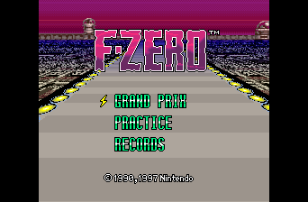
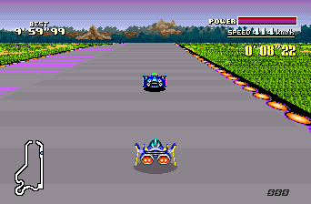
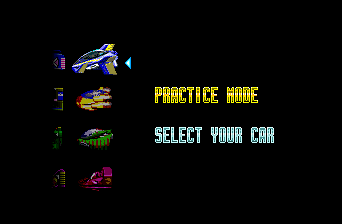
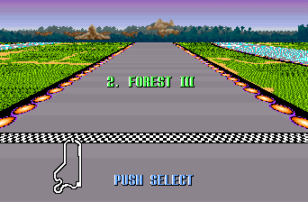

# FZeroSNESRecomp

Static recompilation of *F-Zero* (SNES) into native C, using the
[snesrecomp](https://github.com/mstan/snesrecomp) framework. This repo
is the per-game side: the runtime, the recompiled C output, the
per-game `.cfg`, and the build glue.

<p align="center">
  
  
  <br>
  
  
</p>

## What "static recompilation" means here

The 65816 CPU code from the ROM is statically translated to C — every
function the analysis can prove is a real generated C function in
`src/gen/`. Execution is **LLE-first**: an authoritative 65816
interpreter (LakeSnes-derived, MIT) is the correctness floor, and the
statically compiled bodies are exact, proven materializations on top of
it — anything the static pass cannot prove keeps running through the
interpreter, loudly. **The rest of the SNES is not recompiled** — it's
hardware. PPU rendering, the APU/SPC700 audio coprocessor, DMA and
HDMA channels, hardware register I/O, and bank-mapping run through
snesrecomp's own runner implementations (`snesrecomp/runner/`). Same
model as N64Recomp and similar projects: recompile the CPU, emulate the
silicon.

The ROM is **never** redistributed — you supply your own legally-dumped
copy.

## Current status: 1.4.0

This private release adds launcher **Display** settings for GLSL shader
presets, including `CRT Soft`, and exposes F-Zero's aspect choices there.
Selecting a shader uses the OpenGL presentation path; leaving it unset keeps
the existing SDL renderer path.

The release also includes the optional, all-or-nothing **BS Deluxe** content
plugin. The BS Satellaview mod is included with permission from its authors:
GuyPerfect, Porthor, and PowerPanda. The
[mod and build instructions](docs/BS_DELUXE_EXPLORATION.md) describe its
private archive import, separate saves, execution policy and remaining
validation limits.

Open **Settings > Display** in recomp-ui to configure:

- **Aspect ratio:** 4:3, 16:9, 21:9, 32:9, or Fit to window. When the
  built-in Widescreen/Presentation mod is enabled, that mod's aspect option is
  authoritative and overrides the generic Display aspect selection.
- **Shader:** None, CRT Soft, LCD Grid, Sharp, Warm Composite, or a custom
  `.glsl` / `.glslp` file placed under `assets/shaders`.

Open **Mods** in recomp-ui to configure independent built-in plugins:

- **Widescreen:** 16:9, 21:9, 32:9, or Fit (clamped to 4:3–32:9). Disabling
  it restores stock 4:3. Race HUD groups follow the outer edges; menus and
  course titles remain centered.
- **Presentation FPS:** Auto display refresh or 60, 90, 120, 144, 165, 240,
  or 360 FPS. Disabling it restores the original presentation cadence.
  Native widescreen interpolates motion; stock 4:3 repeats authentic frames.
- **BS Deluxe:** original and Satellaview content together, including eight
  machines, 25 courses, alternate leagues/layouts and Practice ghosts. Enable
  before Play; the stock ROM stays unchanged and Deluxe saves are separate.
  The private release includes the verified USA 1.0 data and upstream credits.

Game logic stays at 60.098811862 Hz. Opponent activation follows the viewport,
so changing aspect can change gameplay. FPS targets depend on hardware capacity.

The game boots, and the title screen and the attract-mode demo race run
cleanly. The wide attract loop completed a 108,180-frame (30 simulated minute)
soak, and the owner playtested and accepted the checkpoint. Full-cup and
exhaustive all-course coverage have not been established. See the
[renderer design and validation record](docs/ADAPTIVE_RENDERER.md).

Validated so far, on the headless soak host:

| Check | Result |
|---|---|
| Boot to title (600 frames) | clean |
| Attract-mode demo race (10,800 frames / 3 min) | clean, no runtime failures |
| Raster-split delivery vs interpreter oracle | 1,457 / 1,460 frames identical |
| Audio | active every frame, non-zero peak, 4 startup underruns |

The three non-identical raster frames are a scene-transition HDMA
difference and are tracked as an open item, not a regression.

### Target ROM

- Title: F-Zero
- Region/revision: `F-ZERO` (USA), version 1.0
- Mapping: LoROM (`$20`), 512 KiB, headerless
- Cartridge hardware: ROM + 2 KiB battery-backed SRAM, **no enhancement chip**
- Expected SHA-256: `bf16c3c867c58e2ab061c70de9295b6930d63f29f81cc986f5ecae03e0ad18d2`
- Expected SHA-1: `d3efd32b68f1fe37a82db9d9929b7ca7cc1a3af4`

512-byte SMC copier headers are stripped before hashing, so headered or
unheadered images both work.

## Quick start (from source)

Download the Windows x64 ZIP from the repository's Releases page, extract
the whole archive, and run `FZeroSNESRecomp.exe`. On first launch recomp-ui
asks for your **legally-obtained** *F-Zero (USA)* ROM (`.sfc` / `.smc`);
the path you pick is cached to `rom.cfg` next to the exe so subsequent
launches skip the picker.

Edit `keybinds.ini` (auto-generated next to the exe on first run) to
remap keys, then restart — the launcher's **Controls** page edits the
same file.

## Controls (default `keybinds.ini`)

| SNES button | Default key |
|-------------|-------------|
| D-Pad       | Arrow keys |
| A           | X |
| B           | Z |
| X           | S |
| Y           | A |
| L           | C |
| R           | V |
| Start       | Enter |
| Select      | Right Shift |

**Xbox / PlayStation / Switch Pro controllers** are auto-detected via
SDL_GameController (XInput on Windows). Plug it in before launching, or
hot-plug after.

Host shortcuts:

| Action | Default |
|---|---|
| Save state 1-12 | Shift+F1..F12 |
| Load state 1-12 | F1..F12 |
| Toggle pause | P |
| Toggle fullscreen | Alt+Enter |
| Cycle widescreen aspect | Ctrl+F6 |
| Enable/cycle presentation FPS | Ctrl+F7 |
| Soft reset (retain SRAM) | Ctrl+R |
| Quit | Esc |

## Reporting crashes

The game continuously records its own boot/run diagnostics. If it
crashes (or exits with an error) it writes these files next to the
executable — attaching them to an issue usually lets the crash be
diagnosed without a repro:

- `crash_report_<timestamp>.json` and `crash_minidump_<timestamp>.dmp`
  — written at the moment of a crash; never overwritten by later runs.
- `last_run_report.json` — written at the end of **every** run (crash or
  clean exit), so grab it right after the bad run if there is no
  `crash_report_*` file.

None of these contain personal data beyond your OS version, hardware
model, and the folder the game runs from.

## Building from source

Private source checkout setup:

1. Accept the GitHub repository invitation.
2. Make sure your GitHub SSH key is configured, or authenticate with the
   GitHub CLI and use the equivalent HTTPS clone URL.
3. Clone with all framework dependencies, then run the idempotent
   bootstrap check:

```bash
git clone --recurse-submodules git@github.com:mstan/FZeroSNESRecomp.git
cd FZeroSNESRecomp
bash tools/bootstrap.sh
```

`snesrecomp/` is a pinned submodule from
[mstan/snesrecomp](https://github.com/mstan/snesrecomp), and `recomp-ui/`
is the shared launcher UI submodule. If you cloned without
`--recurse-submodules`, `tools/bootstrap.sh` initializes them and their
nested dependencies. The gitlink in this repository is the dependency
pin; there is no separate SHA to keep synchronized.

Generated game C is not redistributed. Before the first build, stage a
legally obtained USA ROM as `fzero.sfc`, then run:

```bash
cp "/path/to/F-Zero (USA).sfc" fzero.sfc
bash tools/regen.sh
```

`fzero.sfc`, `src/gen/`, build directories, local captures, save files,
and crash reports are ignored local artifacts. Do not commit or share the
ROM, generated C, or build output.

On Windows 10 or newer, install [MSYS2](https://www.msys2.org/) with the
mingw64 toolchain (`cmake`, `ninja`, `gcc`), the SDL3 development
package, Git, Python 3.9 or newer, and `rustup`. Run the bootstrap and
regeneration steps from Git Bash, then build from PowerShell:

```powershell
cmake -S . -B build -G Ninja -DCMAKE_BUILD_TYPE=Release `
  -DCMAKE_C_COMPILER="C:/msys64/mingw64/bin/gcc.exe" `
  -DCMAKE_CXX_COMPILER="C:/msys64/mingw64/bin/g++.exe" `
  -DCMAKE_PREFIX_PATH="C:/msys64/mingw64"
cmake --build build --parallel
```

Keep the C and C++ compilers in the same toolchain family as the SDL3
package you point CMake at. Mixing a standalone clang with MSYS2's
GCC-built SDL3 puts the MinGW C headers ahead of libc++ and the
launcher's C++ translation units fail to compile.

SDL3 is the default. SDL2 remains an explicitly supported fallback:
configure a separate tree with `-DSNESRECOMP_SDL_BACKEND=SDL2`.

`build.ps1` is a convenience wrapper for a default Release build once
your toolchain is already on `PATH`.

### macOS / Linux (CMake)

Builds natively on macOS (Apple Silicon + Intel) and Linux with
clang/gcc. On macOS, install dependencies with
`brew install cmake sdl3 ninja python3`. On Ubuntu/Debian, install
`build-essential cmake ninja-build libsdl3-dev python3`.

```bash
cmake -S . -B build-dev -G Ninja -DCMAKE_BUILD_TYPE=RelWithDebInfo
cmake --build build-dev --target FZeroSNESRecomp
```

On macOS, add `-DCMAKE_PREFIX_PATH="$(brew --prefix)"` if CMake does not
find Homebrew's SDL3.

### Regenerating the recompiled C (contributors)

1. Stage a legally-obtained USA ROM as `fzero.sfc` at the repo root
   (`.gitignore` excludes it).
2. Run `bash tools/regen.sh`. It drives the recompiler over every
   `recomp/bank*.cfg` and writes `src/gen/bank*_v2.c` + `dispatch_v2.c`.
   The script builds and requires the fast native analyzer by default;
   set `SNESRECOMP_ANALYSIS_BACKEND=python` to use the slower reference
   path instead.
3. Rebuild as above.

`recomp/tier2_coverage.json` is the checked-in AOT coverage profile:
clean interpreter-tier discoveries harvested from a real run, fed back
as optional AOT roots on the next regeneration. It never replaces the
interpreter fallback, and `v2_emit` rejects any tuple that is not safe
to materialize. To refresh it, run the headless host with
`SNESRECOMP_TIER2_CAPTURE=1`, then copy the emitted
`tier2_f_zero_*.json` over `recomp/tier2_coverage.json` and regenerate.
Without the profile the analysis finds 9 roots / 37 AOT variants; with
it, 225 roots / 425 AOT variants.

## The headless bring-up host

`FZeroSNESRecompHeadless` links no SDL and no launcher. It boots the
game, runs a fixed number of frames and reports whether the run showed
the activity a real boot produces:

```bash
./build/FZeroSNESRecompHeadless fzero.sfc 3600
# fzero_native: PASS frames=3600 ... logic_changes=3530 video_active=3476 ...
```

Useful environment variables:

| Variable | Effect |
|---|---|
| `SNESRECOMP_FRAME_DUMP` | write the final frame as a PPM |
| `SNESRECOMP_WRAM_DUMP` | write the final 128 KiB of WRAM |
| `SNESRECOMP_WAV` | capture the run's audio |
| `SNESRECOMP_INPUT_SCRIPT` | scripted input, `FIRST[-LAST]:MASK[,...]` |
| `SNESRECOMP_TIER2_CAPTURE=1` | emit the AOT coverage profile |
| `SNESRECOMP_RASTER_TRACE=1` | log the per-frame raster-IRQ replay |
| `SNESRECOMP_LLE_INTERP_TARGET_FILE` | AOT deny list (interpreter oracle) |

The last two are the bring-up workhorses. Regenerating with
`SNESRECOMP_EMIT_AOT_DENY_GATE=1` makes every AOT body tier down to the
interpreter when its PC is listed in the deny file, which gives a full
interpreter oracle *and* a rebuild-free way to delta-debug which AOT
body diverges from it. Always regenerate without that variable before
packaging.

## Mode 7 and the raster-IRQ replay

F-Zero draws its track through Mode 7 and reprograms the PPU from raster
IRQs — four chained splits per frame (each handler re-arms `vTimer` for
the next band: lines 18 → 28 → 47 → 86). The CPU runs a whole frame
ahead of the deferred line renderer, so `src/fzero_runtime.c` snapshots
the PPU register file at the top of each frame, records what each IRQ
changed and on which scanline, and replays those deltas at the matching
line while the renderer walks the frame.

Delivering those IRQs at all requires capping each execution slice at
the next comparator crossing (`snes_next_irq_master`). `snes->inIrq` is
a single latch: a slice that sweeps a whole frame coalesces all four
splits into one delivery, the chain collapses to its first band, and the
track renders with the sky's Mode 7 matrix.

## Repo layout

| Path | Purpose |
|------|---------|
| `src/fzero_runtime.c` | Frame loop, raster-IRQ capture/replay, save-state hooks. |
| `src/sdl_main.c` | Desktop host: launcher, window, audio, input, save states. |
| `src/headless_main.c` | Headless bring-up / soak host (no SDL). |
| `src/gen/` | Recompiler output (gitignored; regenerated from ROM). |
| `recomp/bank*.cfg` | Per-bank declarations + hints the framework cannot derive from the ROM alone. |
| `recomp/funcs.h` | Auto-regenerated by `tools/regen.sh`; never hand-edit. |
| `recomp/tier2_coverage.json` | Checked-in AOT coverage profile. |
| `snesrecomp/` | Pinned submodule containing the [snesrecomp framework](https://github.com/mstan/snesrecomp). |
| `recomp-ui/` | Pinned submodule containing the shared, console-agnostic launcher UI. |

## License

Not yet declared. Code in this repo is original.

The *F-Zero* ROM and any data extracted from it are **not** in this repo
and are not licensed for redistribution.
